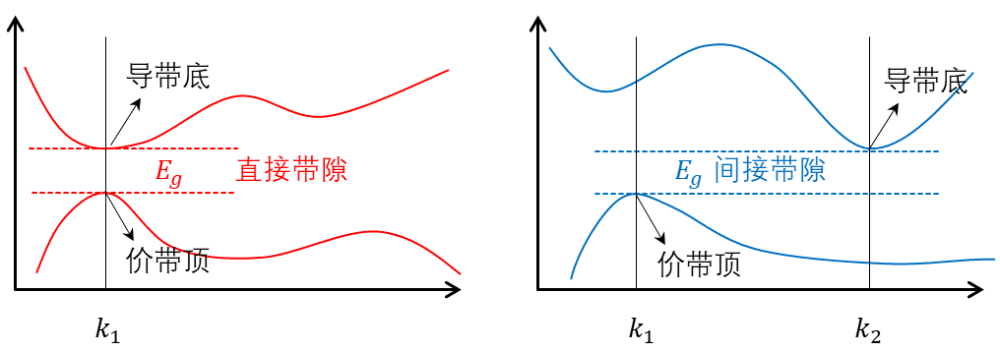
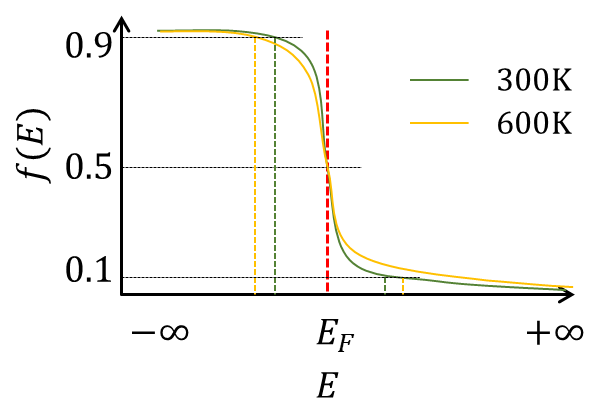
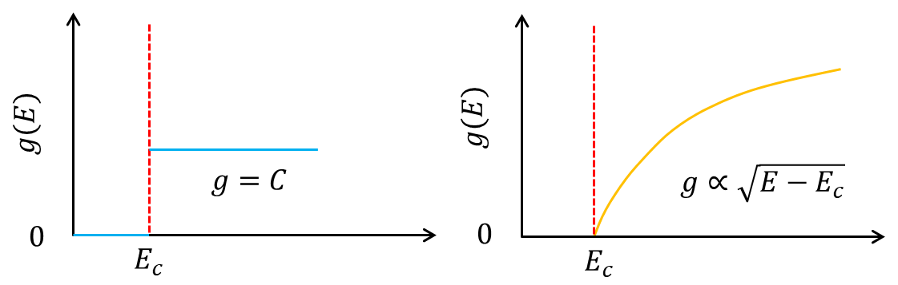

---
title: "半导体器件基础习题册（一）"
author: "Jiawei Xia"
date: "2026-07-19"
description: "半导体能带、有效质量、态密度、费米分布与本征载流子统计习题及参考解答。"
categories:
  - 半导体器件
  - 半导体物理
tags:
  - 能带理论
  - 有效质量
  - 态密度
  - 费米分布
  - 本征半导体
execute:
  eval: false
---

::: {.callout-note appearance="simple" title="习题册信息"}
- **模块编号：** SD-01
- **对应进度：** NPTEL Fundamentals of Semiconductor Devices，Lectures 1--6
- **题目数量：** 16 题
:::

本套习题涉及能带基础、有效质量、空穴、直接与间接带隙、态密度、费米分布和本征载流子浓度，不涉及掺杂及非本征半导体。NPTEL 官方课程将能带物理与载流子统计作为后续输运和器件学习的基础。[nptel.ac.in](https://nptel.ac.in/courses/108108122)

# 本套习题覆盖范围

- $E-k$ 色散关系与有效质量

- 导带底、价带顶附近的抛物线近似

- 电子与空穴的等效描述

- 直接带隙与间接带隙

- 三维体材料的态密度

- 多能谷与态密度有效质量

- 费米--狄拉克分布

- 玻尔兹曼近似及其适用条件

- 导带电子浓度与价带空穴浓度

- 本征费米能级与本征载流子浓度

- 温度对载流子浓度的影响

- 二维材料态密度的拓展比较

# 学习目标

完成本套习题后，应能够：

1.  从能带曲率判断载流子的有效质量及其符号；

2.  理解为何价带中的大量电子可以等效描述为少量空穴；

3.  从能量和晶体动量守恒角度区分直接与间接带隙；

4.  从 $k$ 空间状态计数推导三维态密度；

5.  将态密度与费米分布结合，建立载流子浓度的积分表达；

6.  判断玻尔兹曼近似的适用范围；

7.  推导并计算本征载流子浓度和本征费米能级；

8.  分析有效质量、带隙和温度对本征载流子统计的影响；

9.  初步理解三维体材料与二维材料态密度的区别。

# 前置知识

- 晶体中的允许能带与禁带

- 波矢 $k$ 和 $E-k$ 色散关系

- 基本微积分与高斯积分

- 指数函数和数量级计算

- 费米--狄拉克分布的基本定义

## 本套通用物理常数

无特别说明下，数值题中相关参数采用：

$$
\begin{aligned}
q & = 1.602 \times 10^{- 19}\,\mathrm{C}, \\
m_{0} & = 9.109 \times 10^{- 31}\,\mathrm{kg}, \\
\hbar & = 1.055 \times 10^{- 34}\,\mathrm{J}\cdot\mathrm{s}, \\
k_{B} & = 1.381 \times 10^{- 23}\,\mathrm{J}\cdot\mathrm{K}^{- 1} = 8.617 \times 10^{- 5}\,\mathrm{eV}\cdot\mathrm{K}^{- 1}, \\
1\,\mathrm{eV} & = 1.602 \times 10^{- 19}\,\mathrm{J}, \\
1\,\mathring{\mathrm{A}} & = 0.1\,\mathrm{nm} = 1 \times 10^{- 10}\,\mathrm{m}
\end{aligned}
$$

# 习题正文

## 第一层：基本概念与直接应用

### SD-01-001｜能带曲率与有效质量

- **知识点：** 有效质量、$E - k$关系、能带曲率

- **题型：** 基础概念辨析题

- **难度：** ★

- **来源：** 经典教材改编；Streetman 与 Banerjee，主题：能带中的电子运动

- **建议用时：** 10分钟

#### 题目

某一维晶体中存在以下三个局域能带：

$E_{A}(k) = E_{A}^{0} + \alpha\ k^{2}$,

$E_{B}(k) = E_{B}^{0} + 4\alpha\ k^{2}$,

$E_{C}(k) = E_{C}^{0} - \alpha\ k^{2}$,

其中 ($\alpha > 0$)。

回答下列问题：

1.  判断三个能带在$k = 0$附近是能带极小值/极大值。

2.  比较 A、B、C 三个能带中载流子有效质量绝对值的大小。

3.  判断三个能带对应的电子有效质量是正还是负。

4.  说明"能带越平坦，有效质量越大"这一表述的准确含义。

5.  有效质量较大是否意味着电子的静止质量发生了改变？说明理由。

#### 参考解答
**1.** 抛物线开口向上则为最小值，向下则为最大值。三者依次为：最小值、最小值、最大值

**2.** 有效质量的定义$m^{*} = \hbar^{2}\left( \frac{d^{2}E}{dk^{2}} \right)^{- 1}$

$$
\left| m_{A}^{*} \right| = \frac{\hbar^{2}}{2\alpha}
$$

$$
\left| m_{B}^{*} \right| = \frac{\hbar^{2}}{8\alpha}
$$

$$
\left| m_{C}^{*} \right| = \frac{\hbar^{2}}{2\alpha}
$$

有效质量绝对值关系为

$$
\left| m_{A}^{*} \right| = \left| m_{C}^{*} \right| > \left| m_{B}^{*} \right|
$$

补充：有效质量的半经典推导

$$
v = \frac{1}{\hbar}\frac{dE}{dk},\quad\quad\hbar\frac{dk}{dt} = F,
$$

故

$$
a = \frac{dv}{dt} = \frac{1}{\hbar^{2}}\frac{d^{2}E}{dk^{2}}F
$$

定义$F = m^{*}a$，得到

$$
m^{*} = \hbar^{2}\left( \frac{d^{2}E}{dk^{2}} \right)^{- 1}
$$

结合曲率公式

$$
\rho = \frac{f^{''}(x)}{\left\lbrack 1 + \left( f'(x) \right)^{2} \right\rbrack^{3/2}},
$$

当处于抛物线底部/顶部时，一阶导近似为零，则$\rho \approx f^{''}(x)$。因此，在低能时，可认为**有效质量与能带曲率的**成反比。

**3.** 通过能带开口方向判断有效质量的符号，开口向上为正，向下为负

**4.** 可从两种角度理解

1） 在能带极值点附近，有效质量与能带曲率成反比。能带越平坦，则曲率越小，有效质量越大；反之亦然

2） 能带的斜率反映群速度大小，能带越平坦，则群速度越小，这意味着电子的移动更困难，反映其惯性（即有效质量）越大。

**5.** 否

静止质量描述的是电子在真空中受到外力时，其加速度与外力的关系。而有效质量描述的是电子在周期性势场中，加速度与外力的关系，其本质是对电子量子效应的封装。电子在晶格中运动，会受到周期性势场的作用，电子的准动量与能量表现出特有的能带结构。对能带曲线进行量子力学推导，可使晶格内部的作用力被量化。具体而言，将能带对波矢的二阶导数（即能带曲率）定义为有效质量，可以将周期性势场的作用封装进这个等效系数。从而在形式上，使得外力与加速度的关系回到经典的牛顿第二定律的形式。

综上，有效质量不等同于电子的真实静止质量，其反映了周期性势场对电子的作用。

### SD-01-002｜由色散关系测定有效质量

- **知识点：** 抛物线能带、有效质量计算、单位换算

- **题型：** 数值计算题

- **难度：** ★★

- **来源：** 原创

- **建议用时：** 15分钟

#### 题目

某半导体导带底位于$k = 0$。在导带底附近，实验测得：

$$
E(k) - E_{c} = 0.200\,\mathrm{eV}
$$

对应于

$$
k = 0.100\,\mathring{\mathrm{A}}^{- 1}
$$

假设导带底附近可以采用各向同性抛物线近似。

1.  计算该导带电子的有效质量$m_{n}^{*}$。

2.  用自由电子质量$m_{0}$为单位表示结果。

3.  若另一种材料在相同$k$偏移下满足

> $$E(k) - E_{c} = 0.050\,\mathrm{eV}$$
>
> 比较两种材料导带的曲率和有效质量。

4.  在两种材料中的电子受到大小相同的外力时，比较其加速度大小。

#### 参考解答
**1.** 目标是求解抛物线的二阶导

色散关系式

$$
E(k) = bk^{2} + E_{c}
$$

根据题目有$E(0.1) = 0.2 + E_{c}$，得$b = 20\,\mathrm{eV}\cdot\mathring{\mathrm{A}}^{2}$.

有效质量，

$$
m_{n}^{*} = \hbar^{2}\left( \frac{d^{2}E}{dk^{2}} \right)^{- 1} = \frac{\hbar^{2}}{2b} = \frac{\hbar^{2}}{40} = 1.7369 \times 10^{- 31}\,\mathrm{kg}
$$

**2.**

$$
m_{n}^{*} = \frac{m_{n}^{*}}{m_{0}}m_{0} = 0.19m_{0}
$$

**3.** 色散关系的系数记为$b_{2} = 5\,\mathrm{eV}\cdot\mathring{\mathrm{A}}^{2}$,

曲率比

$$
\frac{\left( \frac{d^{2}E_{1}}{dk^{2}} \right)}{\left( \frac{d^{2}E_{1}}{dk^{2}} \right)} = \frac{2b_{1}}{2b_{2}} = 4
$$

有效质量比

$$
\frac{\frac{m_{1}^{*}}{m_{2}^{*}} = \left( \frac{d^{2}E_{1}}{dk^{2}} \right)^{- 1}}{\left( \frac{d^{2}E_{1}}{dk^{2}} \right)}^{- 1} = \frac{2b_{2}}{2b_{1}} = \frac{1}{4}
$$

**4.** 加速度之比与有效质量之比成反比

$$
\frac{a_{1}}{a_{2}} = \frac{m_{2}^{*}}{m_{1}^{*}} = 4
$$

### SD-01-003｜空穴描述的建立

- **知识点：** 价带电子、空穴、波矢、速度与电荷

- **题型：** 概念推导题

- **难度：** ★★

- **来源：** 经典教材改编；Pierret，主题：电子与空穴

- **建议用时：** 20分钟

#### 题目

考虑一个除去单个电子之外完全充满的价带。缺失电子原本处于波矢为 $\mathbf{k}_{0}$ 的状态。

1.  说明为什么完全充满的价带在外场下不能产生净的载流子响应。

2.  从"满价带贡献减去缺失电子贡献"的角度，确定空穴的：

    - 电荷；

    - 波矢；

    - 晶体动量；

    - 群速度；

    - 能量。

3.  说明为什么可以用正有效质量的空穴代替价带顶附近具有负有效质量的电子。

4.  判断"空穴是晶体中真实存在的一种基本粒子"这一说法是否准确，并给出严格表述。

5.  解释为什么空穴概念只在能带接近充满时特别有效。

#### 参考解答

**1.** 价带完全充满的情况下，因为每个$k$状态都被占据，且在时间反演对称性情况下，

$$
E\left( \mathbf{k} \right) = E\left( - \mathbf{k} \right),\ \mathbf{v}\left( - \mathbf{k} \right) = - \mathbf{v}\left( \mathbf{k} \right)
$$

所以

$$
\sum_{full}^{}{\mathbf{v}\left( \mathbf{k} \right)} = 0,
$$

满带没有净的载流子响应。

**2.** 设缺失的电子的相关参数分别为，电荷量$- q$，群速度$v_{e}$，能量为$E_{e}$

**（1）** 假设满价带的电荷量为$N$，缺失一个电子后的电荷量为$N - ( - q) = N + q$，空穴的电荷量$q_{h} = (N + q) - N = q$，即电荷量大小与电子相同，值为正。

**（2）** 满价带的总波矢为$\sum_{full}^{}\mathbf{k}$，缺失一个电子后的总波矢$\sum_{full}^{}\mathbf{k} - \mathbf{k}_{0}$，空穴的波矢$\mathbf{k}_{h} = \left( \sum_{full}^{}\mathbf{k} - \mathbf{k}_{0} \right) - \sum_{full}^{}\mathbf{k} = - \mathbf{k}_{0}$。

(3)晶体动量$\mathbf{p}_{h} = - \hbar\mathbf{k}_{0}$

(4)满价带的净电流为零。假设缺失电流的体系电流为$I$，在缺失处填入一个电荷为$- q$的电子，则其携带的电流为$- qv_{e}$。填入电荷后的体系电流为

$$
- qv_{e} + I = 0.
$$

因此$I = qv_{e}$。空穴的群速度$v_{h} = \frac{I}{q_{h}} = v_{e}$

**（5）** 假设满价带的能量为$E_{full}$，缺失一个电子后的总能量为$E_{full} - E_{e}$，空穴的能量为$E_{h} = \left( E_{full} - E_{e} \right) - E_{full} = - E_{e}$。

**3.** 空穴的有效质量

$$
m_{h}^{*} = \hbar^{2}\left( \frac{d^{2}E_{h}}{dk_{h}^{2}} \right)^{- 1} = \hbar^{2}\left( \frac{d^{2}\left( - E_{e} \right)}{\left( - dk_{e} \right)^{2}} \right)^{- 1} = - \hbar^{2}\left( \frac{{d^{2}E}_{e}}{dk_{e}^{2}} \right)^{- 1} = - m_{e}^{*}
$$

**4.** 不能。空穴的本质是一群电子运动等效，是价带中缺失电子所对应的准粒子，而不意味着引入了一种真实的粒子。

**5.** 当价带接近充满时，体系中只有少量未被占据的状态，此时空穴的引入，可使对电子群的集体行为的研究转化为对少量空穴运动行为的追踪，从而极大地简化了研究难度。若价带未接近充满，如金属，体系存在大量未被占据的状态，即使引入空穴概念，我们仍然需要对大量空穴的集体行为进行研究，导致问题并没有被简化。

### SD-01-004｜六个常见表述的判断与纠错

- **知识点：** 有效质量、空穴、带隙、态密度、费米能级

- **题型：** 判断与纠错题

- **难度：** ★★

- **来源：** 原创；依据 NPTEL 有效质量、能带和载流子统计主题设计。NPTEL 的相关公开材料分别讨论了有效质量以及态密度问题。[YouTube](https://www.youtube.com/watch?v=68AcHaqfBgs)

- **建议用时：** 20分钟

#### 题目

判断下列说法是否正确。对于不准确的说法，改写为严格、完整的表述。

1.  有效质量是材料中电子实际质量与自由电子质量之差。

2.  价带顶附近电子的有效质量为负，因此这些电子具有负惯性。

3.  空穴浓度等于价带中所有未被电子占据的量子态数量。

4.  费米能级表示半导体中电子所能占据的最高能量。

5.  在任意温度下，能量等于费米能级的状态被电子占据的概率均为 (1/2)。

6.  直接带隙材料和间接带隙材料的主要区别只是带隙数值大小不同。

#### 参考解答

**1.** 不正确。有效质量是电子在周期性势场中的等效动力学参数。

**2.** 不正确。价带顶附近电子可具有负的有效惯性响应，即在半经典方程中加速度方向与外力相反；这不表示电子的静止质量为负。实际分析通常改用正电荷、正有效质量的空穴。

**3.** 不准确。空穴数量等于价带中所有未被电子占据的量子态数量，空穴浓度等于单位体积（二维材料中为单位面积）内，价带中所有未被电子占据的量子态数量。

**4.** 不正确。费米能级是热平衡化学势。对$T > 0$，费米能级满足电子占据概率为二分之一。在绝对零度的金属中，电子自下而上依次填充能级；但在半导体中，费米能级位于能隙当中，不是一个具体电子占据边界，电子在热激发下可以处于具有更高能量的导带当中。

**5.** 正确。在 $T = 0$ 的阶跃函数定义中，$E = E_{F}$ 单点的取值是约定性的。

**6.** 不正确。直接带隙和间接带隙的关键区别是导带底盒价带顶是否位于同一波矢，而不是带隙大小。直接带隙表示价带顶和导带底的两个电子态具有相同的波矢，间接带隙表示价带顶和导带底的两个电子态具有不同的波矢。前者的电子跃迁只需要改变能量（如通过光子），后者的电子跃迁需要同时改变能量和动量（如通过声子）。

## 第二层：概念联系与标准分析

### SD-01-005｜直接带隙与间接带隙的能带图

- **知识点：** 直接带隙、间接带隙、能量守恒、晶体动量守恒

- **题型：** 能带图分析题

- **难度：** ★★

- **来源：** 经典教材改编；Neamen，主题：半导体能带结构

- **建议用时：** 15分钟

#### 题目

在同一坐标系中分别绘制一种直接带隙半导体和一种间接带隙半导体沿某一高对称方向的简化 (E-k) 图，并在图中标出：

- 价带顶；

- 导带底；

- 带隙 ($E_{g}$)；

- 最低能量的带间跃迁；

- 跃迁前后的电子波矢。

随后回答：

1.  两种材料中导带底与价带顶在 (k) 空间中的相对位置有何区别？

2.  为什么光子通常可以提供跃迁所需的能量，却难以单独提供间接跃迁所需的晶体动量变化？

3.  在间接带隙材料中，最低能量带间跃迁还需哪一类晶格激发参与？

4.  "间接带隙材料不能吸收光"这一说法是否正确？

5.  仅根据一个材料的带隙数值，能否判断它是直接带隙还是间接带隙？

{#fig-direct-indirect-bandgap fig-align="center"}

#### 参考解答

**1.** 直接带隙中价带顶和导带底的两个电子态具有相同的波矢，间接带隙中价带顶和导带底的两个电子态具有不同的波矢。前者的电子跃迁只需要改变能量（如通过光子），后者的电子跃迁需要同时改变能量和动量（如通过声子）。

**2.** 光子动量为

$$
p_{\gamma} = \frac{E_{\gamma}}{c},q_{\gamma} = \frac{E_{\gamma}}{\hbar c}.
$$

可见光光子的波矢通常为$10^{7}\,\mathrm{m}^{- 1}$，二布里渊区尺度和间接能谷间隔通常约为$10^{10}\,\mathrm{m}^{- 1}$，因此光子动量太小，不能独立补偿间接跃迁所需要的晶体动量。

**3.** 声子。声子的引入可以改变动量

**4.** 不正确。间接跃迁需要声子参与，既可能是吸收声子，也可能是发射声子。因此间接带隙材料能够吸光，只是带边附近的声子辅助吸收通常比直接跃迁弱。

**5.** 不能。

### SD-01-006｜两种材料的光学跃迁比较

- **知识点：** 直接跃迁、间接跃迁、吸收阈值

- **题型：** 定性综合题

- **难度：** ★★

- **来源：** 经典教材改编；Sze 与 Ng，主题：直接和间接带间跃迁

- **建议用时：** 15分钟

#### 题目

材料A是直接带隙半导体，带隙为$1.42\,\mathrm{eV}$；材料B是间接带隙半导体，带隙为$1.12\,\mathrm{eV}$。

现分别用能量为 ①$1.20\,\mathrm{eV}$、②$1.42\,\mathrm{eV}$和 ③$1.60\,\mathrm{eV}$的单色光照射两种本征材料。

对每一种光子能量，分别讨论：

1.  从能量守恒角度，价带电子是否可能跃迁到导带？

2.  若能量条件满足，晶体动量守恒是否能由光子单独满足？

3.  两种材料的吸收过程可能具有怎样的相对强弱差异？

4.  提高或降低温度可能对材料B的间接跃迁产生什么影响？

5.  带隙较小是否必然意味着材料在带边附近具有更强的光吸收？

本题不要求使用具体吸收系数公式。

#### 参考解答

**1.** 仅从能量守恒分析，②和③光子可使材料A的价带电子跃迁，所有光子均可使材料B发生跃迁

**2.** 光子携带的动量通常不足以连接间接能谷

**3.**

①$h\nu = 1.20\,\mathrm{eV}$：材料 A 低于直接带隙，不能发生带边直接跃迁；材料 B 从能量上可能发生声子辅助间接跃迁，实际阈值需计入声子能量 $\pm \hbar\omega_{q}$。

②$h\nu = 1.42\,\mathrm{eV}$：材料 A 达到直接带隙阈值，材料 B 也可能发生间接跃迁。但在理想三维抛物线模型中，直接吸收在精确阈值处从零开始，因此仅凭题给信息不能严格断言此时 $A \gg B$。

③$h\nu = 1.60\,\mathrm{eV}$：两者均可吸收，通常直接带隙材料 A 的带边吸收更强。

**4.** 温度会改变晶格振动的强弱，更强的晶格振动会产生动量更大的声子，使间接跃迁更容易发生

温度升高的主要作用时改变声子占据数

$$
N_{q} = \frac{1}{e_{q}^{\frac{\hbar\omega}{k_{B}T}} - 1}
$$

声子吸收过程的权重与$N_{q}$有关，声子发射过程与$N_{q} + 1$有关。

**5.** 否。带隙较小只意味着能量阈值较低，不保证带边吸收更强；跃迁矩阵元、联合态密度和动量守恒条件同样关键。

### SD-01-007｜三维抛物线能带的态密度推导

- **知识点：**$k$空间状态计数、三维态密度、简并度

- **题型：** 数学推导题

- **难度：** ★★★

- **来源：** 经典教材改编；Pierret 与 Neamen，主题：三维半导体态密度

- **建议用时：** 30分钟

#### 题目

考虑体积为$V = L^{3}$的三维半导体，采用周期性边界条件。导带底附近满足各向同性抛物线色散关系：

$$
E(k) = E_{c} + \frac{\hbar^{2}k^{2}}{2m_{n}^{*}}
$$

从$k$空间中的允许状态计数出发：

1.  确定每一个允许$k$状态在$k$空间中占据的体积。

2.  计入自旋简并，求波矢模长不超过$k_{0}$的总量子态数。

3.  将总量子态数写成能量$E$的函数。

4.  推导单位体积、单位能量范围内的导带态密度$g_{c}(E)$。

5.  说明为什么三维抛物线导带的态密度在导带底为零。

6.  分析$g_{c}(E)$对有效质量$m_{n}^{*}$的依赖关系。

7.  采用类似方法写出价带顶附近的空穴态密度表达式。

#### 参考解答

**1.** 布洛赫定理要求电子的波函数形式为$\psi(r) = u(r)e^{ik \cdot r}$，周期性要求

$$
k \cdot r = 2\pi n
$$

考虑边长为$L$的三维立方半导体，三个方向的波矢分别满足

$$
k_{x} = n_{x}\frac{2\pi}{L},\ k_{y} = n_{y}\frac{2\pi}{L},\ k_{z} = n_{z}\frac{2\pi}{L}.
$$

周期性边界条件给出，波矢的最小刻度为$\Delta k_{x} = \Delta k_{y} = \Delta k_{z} = \frac{2\pi}{L}$，一个$k$状态占据的微小立方体的体积为

$$
\Omega_{k} = \frac{2\pi}{L} \cdot \frac{2\pi}{L} \cdot \frac{2\pi}{L} = \frac{8\pi^{3}}{L^{3}} = \frac{8\pi^{3}}{V}
$$

**2.** 在$k$空间中，模长小于$k_{0}$的波矢构成了一个半径为$k_{0}$的球体，球体的体积为$V_{k_{0}} = \frac{4\pi k_{0}^{3}}{3}$，总量子态数为，

$$
n = \frac{V_{k_{0}}}{\Omega_{k}} = \frac{4\pi k_{0}^{3}}{3}\frac{L^{3}}{8\pi^{3}} = \frac{k_{0}^{3}L^{3}}{6\pi^{2}}.
$$

计入自旋简并，

$$
N\left( k_{0} \right) = \frac{k_{0}^{3}L^{3}}{3\pi^{2}}
$$

**3.** 当波矢上限为$k_{0}$时，能量上限为，

$$
E = E_{c} + \frac{\hbar^{2}k_{0}^{2}}{2m_{n}^{*}}.
$$

求解$k_{0}$与$E$的关系式，

$$
k_{0} = \sqrt{\frac{2m_{n}^{*}}{\hbar^{2}}\left( E - E_{c} \right)},
$$

代入总量子态数，

$$
N(E) = \frac{k_{0}^{3}L^{3}}{3\pi^{2}} = \frac{L^{3}}{3\pi^{2}}\left\lbrack \sqrt{\frac{2m_{n}^{*}}{\hbar^{2}}\left( E - E_{c} \right)} \right\rbrack^{3} = \frac{L^{3}}{3\pi^{2}}\left\lbrack \frac{2m_{n}^{*}}{\hbar^{2}}\left( E - E_{c} \right) \right\rbrack^{\frac{3}{2}}.
$$

**4.** 单位体积、单位能量内的量子态数

$$
g_{c}(E) = \frac{1}{V}\frac{dN}{dE} = \frac{1}{V}\frac{L^{3}}{3\pi^{2}}\left( \frac{2m_{n}^{*}}{\hbar^{2}} \right)^{3/2}\frac{3}{2}\left( E - E_{c} \right)^{1/2} = \frac{1}{2\pi^{2}}\left( \frac{2m_{n}^{*}}{\hbar^{2}} \right)^{3/2}\left( E - E_{c} \right)^{1/2},\ E \geq E_c\
$$

**5.** 导带低有$E = E_{c}$，代入上式，态密度为$g_{c}\left( E_{c} \right) = 0$。

**6.**

$$
g_{c}(E) = \frac{1}{V}\frac{dN}{dE} = \frac{1}{V}\frac{L^{3}}{3\pi^{2}}\left( \frac{2m_{n}^{*}}{\hbar^{2}} \right)^{3/2}\frac{3}{2}\left( E - E_{c} \right)^{1/2} = \frac{\sqrt{2}}{\pi^{2}\hbar^{3}}\left( E - E_{c} \right)^{1/2}\left( m_{n}^{*} \right)^{3/2}
$$

有效态密度与有效质量的二分之三次方成正比。

**7.** 假设价带顶附近满足各向同性抛物线色散关系，

$$
E(k) = E_{v} - \frac{\hbar^{2}k^{2}}{2m_{p}^{*}}.
$$

那么价带顶的空穴态密度为，

$$
g_{c}(E) = \frac{1}{2\pi^{2}}\left( \frac{2m_{p}^{*}}{\hbar^{2}} \right)^{3/2}\left( E_{v} - E \right)^{1/2},\ \ E \leq E_{v}
$$

### SD-01-008｜有限体积样品中的可用状态数

- **知识点：** 态密度积分、能量区间内的状态数

- **题型：** 数值计算题

- **难度：** ★★★

- **来源：** 原创

- **建议用时：** 25分钟

#### 题目

某三维半导体具有单一、各向同性的导带极小值，其电子有效质量为$m_{n}^{*} = 0.26m_{0}$.取一个体积为$V = 1.00\,\mathrm{\mu m}^{3}$的样品区域。

1.  计算导带底以上$0$至$0.100\,\mathrm{eV}$范围内可容纳的电子量子态总数。计入自旋简并。

2.  计算导带底以上$0.090\,\mathrm{eV}$至$0.100\,\mathrm{eV}$范围内的量子态数。

3.  比较上述两个能量区间的宽度和状态数，说明状态在能量轴上是否均匀分布。

4.  若有效质量变为$0.52m_{0}$，而能带简并度和样品体积均保持不变，重新确定第1问中状态数的变化比例。

本题只计算可用状态数，不考虑这些状态的占据概率。

#### 参考解答

**1.**

$$
N_{0 - 0.1} = \frac{V}{3\pi^{2}}\left\lbrack \frac{2m_{n}^{*}}{\hbar^{2}}\left( E - E_{c} \right) \right\rbrack^{\frac{3}{2}} = \frac{1 \times \left( 10^{- 6} \right)^{3}}{3\pi^{2}}\left\lbrack \frac{2 \times 0.26 \times 9.109 \times 10^{- 31}}{\left( 1.055 \times 10^{- 34} \right)^{2}} \times 0.1 \times 1.602 \times 10^{- 19} \right\rbrack^{3/2} = 1.901 \times 10^{7}
$$

**2.**

$$
N_{0.09 - 0.1} = N_{0 - 0.1} - N_{0 - 0.09} = 2.779 \times 10^{6}
$$

**3.**

单位能量的状态数

$$
\frac{N_{0 - 0.1}}{\Delta E} = \frac{1.901 \times 10^{7}}{0.1\,\mathrm{eV}} = 1.901 \times \frac{10^{8}}{\mathrm{eV}}
$$

$$
\frac{N_{0.09 - 0.1}}{\Delta E} = \frac{2.779 \times 10^{6}}{0.01\,\mathrm{eV}} = 2.779 \times \frac{10^{8}}{\mathrm{eV}}
$$

量子态数在能量轴上不均匀，由于$g_{c}(E) \propto \sqrt{E - E_{c}}$，态密度远离导带底的密度更高

**4.**

$$
N_{0 - 0.1} = \frac{V}{3\pi^{2}}\left\lbrack \frac{2m_{n}^{*}}{\hbar^{2}}\left( E - E_{c} \right) \right\rbrack^{\frac{3}{2}} = \frac{1 \times \left( 10^{- 6} \right)^{3}}{3\pi^{2}}\left\lbrack \frac{2 \times 0.52 \times 9.109 \times 10^{- 31}}{\left( 1.055 \times 10^{- 34} \right)^{2}} \times 0.1 \times 1.602 \times 10^{- 19} \right\rbrack^{3/2} = 5.377 \times 10^{7}
$$

### SD-01-009｜椭球能谷与多能谷态密度

- **知识点：** 各向异性有效质量、态密度有效质量、能谷简并

- **题型：** 推导与参数分析题

- **难度：** ★★★

- **来源：** 公开资料与经典教材改编；NPTEL 半导体物理资料讨论了直接、间接材料及态密度有效质量的区别。[archive.nptel.ac.in](https://archive.nptel.ac.in/content/storage2/courses/115102025/module1/5.html)

- **建议用时：** 30分钟

#### 题目

某半导体的一个导带能谷为旋转椭球形，其色散关系为

$$
E - E_{c} = \frac{\hbar^{2}k_{x}^{2}}{2m_{t}} + \frac{\hbar^{2}k_{y}^{2}}{2m_{t}} + \frac{\hbar^{2}k_{z}^{2}}{2m_{l}}
$$

其中横向有效质量和纵向有效质量分别为$m_{t} = 0.19m_{0},\ \ m_{l} = 0.98m_{0}$。材料中共有$g_{v} = 6$个能量相同的等价能谷。

1.  在给定能量$E$下，写出该能谷对应的等能面方程，并确定三个半轴。

2.  从椭球体积出发，推导单个能谷的态密度。

3.  定义一个各向同性的态密度有效质量$m_{DOS}^{*}$，使单能谷态密度可以写成各向同性形式。

4.  计入六重能谷简并后，写出总态密度。

5.  判断能谷简并是否可以简单理解为将电子有效质量乘以6。

6.  分析在导带底位置不变的情况下，增大能谷简并度对可用态数及载流子浓度的影响。

#### 参考解答

**1.** 等能面方程

$$
1 = \frac{k_{x}^{2}}{\left\lbrack \frac{2m_{t}\left( E - E_{c} \right)}{\hbar^{2}} \right\rbrack} + \frac{k_{y}^{2}}{\left\lbrack \frac{2m_{t}\left( E - E_{c} \right)}{\hbar^{2}} \right\rbrack} + \frac{k_{z}^{2}}{\left\lbrack \frac{2m_{l}\left( E - E_{c} \right)}{\hbar^{2}} \right\rbrack}
$$

三个半轴，分别沿$k_{x}$半轴，$k_{y}$半轴，$k_{z}$半轴，

$$
a = \sqrt{\frac{2m_{t}\left( E - E_{c} \right)}{\hbar^{2}}},\ b = \sqrt{\frac{2m_{t}\left( E - E_{c} \right)}{\hbar^{2}}},\ c = \sqrt{\frac{2m_{l}\left( E - E_{c} \right)}{\hbar^{2}}}
$$

有效质量越大，能带曲率越缓，轴越长。

**2.**

量子态总数，

$$
N = \frac{V_{e}}{\Omega_{k}} = \frac{\frac{4\pi}{3}abc}{\frac{8\pi^{3}}{V}} = \frac{V}{6\pi^{2}}\left( \frac{\sqrt{\left( 2m_{t} \right)^{2}\left( 2m_{l} \right)}}{\hbar^{3}} \right)\left( E - E_{c} \right)^{\frac{3}{2}}
$$

考虑自旋简并，态密度为，

$$
g_{c}(E) = 2\frac{1}{V}\frac{dN}{dE} = \frac{1}{2\pi^{2}}\frac{\sqrt{\left( 2m_{t} \right)^{2}\left( 2m_{l} \right)}}{\hbar^{3}}\left( E - E_{c} \right)^{\frac{1}{2}}
$$

**3.** 将态密度表达式进行整理，

$$
g_{c}(E) = \frac{1}{2\pi^{2}}\left( \frac{2}{\hbar^{2}} \right)^{\frac{3}{2}}\left( m_{t}^{2}m_{l} \right)^{\frac{1}{2}}\sqrt{E - E_{c}}
$$

令$m_{DOS}^{*}\left( m_{DOS}^{*} \right)^{\frac{3}{2}} = \left( m_{t}^{2}m_{l} \right)^{\frac{1}{2}}$，则可定义各向同性的态密度有效质量$m_{DOS}^{*} = \left( m_{t}^{2}m_{l} \right)^{\frac{1}{3}}$。代入数值，$m_{DOS}^{*} = \left( {0.19}^{2} \times 0.98 \right)^{\frac{1}{3}}m_{0} \approx 0.328m_{0}$

**4.** 总态密度

$$
g_{c - total\ }(E) = g_{v} \cdot g_{c}(E) = 6g_{c}(E)
$$

**5.**

将4中的态密度整理为，

$$
g_{c,total\ }(E) = 6g_{c}(E) = \frac{1}{2\pi^{2}}\left( \frac{2}{\hbar^{2}} \right)^{\frac{3}{2}}\left( 6^{2}m_{t}^{2}m_{l} \right)^{\frac{1}{2}}\sqrt{E - E_{c}}
$$

有效质量$m_{DOS,tol}^{*} = \left\lbrack 6^{2}\left( m_{t} \right)^{2}\left( m_{l} \right) \right\rbrack^{\frac{1}{3}} = g_{v}^{\frac{2}{3}}m_{DOS}^{*} \approx 1.084m_{0}$，因此不能认为电子有效质量乘以6。

**6.** 固定$E_{F}$,$T$和带边位置时，可用态数量与非简并载流子浓度均与$g_{v}$成线性关系；若总载流子数由电中性条件固定，则增加简并度还会引起费米能级移动。

### SD-01-010｜费米分布的数值特征

- **知识点：** 费米--狄拉克分布、热展宽、占据概率

- **题型：** 数值计算与图像分析题

- **难度：** ★★

- **来源：** 经典教材改编；Neamen，主题：费米--狄拉克统计

- **建议用时：** 20分钟

#### 题目

考虑处于热平衡的电子系统，温度分别为$T = 300\,\mathrm{K}$和$T = 600\,\mathrm{K}$。

1.  对两个温度，分别计算以下能量处的电子占据概率：\
    $$E - E_{F} = - 3k_{B}T,\  - k_{B}T,\ 0,\ k_{B}T,\ 3k_{B}T$$

2.  验证费米分布在$E_{F}$两侧是否满足\
    $$f\left( E_{F} + \Delta E \right) + f\left( E_{F} - \Delta E \right) = 1$$

3.  在同一能量坐标中定性绘制$300\,\mathrm{K}$和$600\,\mathrm{K}$下的$f(E)$。

4.  在图中标出两个温度下由 $f = 0.9$ 下降至$f = 0.1$ 所对应的大致能量区间。

5.  判断升高温度是否会改变$E = E_{F}$处的占据概率。

6.  说明"费米能级以下的状态全部被占据"在哪一种温度极限下才严格成立。

#### 参考解答

**1.**

300K下

$$
f\left( E_{F} - 3k_{B}T \right) = \frac{1}{\exp\left( - \frac{3k_{B}T}{k_{B}T} \right) + 1} = \frac{1}{e^{- 3} + 1}
$$

$$
f\left( E_{F} - k_{B}T \right) = \frac{1}{e^{- 1} + 1},f\left( E_{F} \right) = \frac{1}{2},f\left( E_{F} + k_{B}T \right) = \frac{1}{e + 1},f\left( E_{F} + {3k}_{B}T \right) = \frac{1}{e^{3} + 1}
$$

  ----------------------
      $$x$$     $$f(E)$$
  --------- ------------
    $$- 3$$   $$0.9526$$

    $$- 1$$   $$0.7311$$

      $$0$$   $$0.5000$$

      $$1$$   $$0.2689$$

      $$3$$   $$0.0474$$
  ----------------------

**2.**

$$
f\left( E_{F} + \Delta E \right) = \frac{1}{\exp\left( \frac{\Delta E}{k_{B}T} \right) + 1}
$$

$$
f\left( E_{F} + \Delta E \right) = \frac{1}{\exp\left( - \frac{\Delta E}{k_{B}T} \right) + 1} = \frac{\exp\left( \frac{\Delta E}{k_{B}T} \right)}{1 + \exp\left( \frac{\Delta E}{k_{B}T} \right)}
$$

$$
f\left( E_{F} + \Delta E \right) + f\left( E_{F} + \Delta E \right) = \frac{1 + \exp\left( \frac{\Delta E}{k_{B}T} \right)}{\exp\left( \frac{\Delta E}{k_{B}T} \right) + 1} = 1
$$

**3.**

{#fig-fermi-dirac-distribution fig-align="center"}

**4.** 如图所示

由 $f = 0.9$ 和 $f = 0.1$ 得

$$
E - E_{F} = \mp k_{B}Tln9 = \mp 2.197k_{B}T.
$$

因此 $0.9 \rightarrow 0.1$ 的总热展宽约为

$$
\Delta E_{0.9 \rightarrow 0.1} = 4.394k_{B}T.
$$

在 $300\,\mathrm{K}$：

$$
E - E_{F} \approx \pm 0.0568\,\mathrm{eV},
$$

总宽度约 $0.1136\,\mathrm{eV}$。

在 $600\,\mathrm{K}$：

$$
E - E_{F} \approx \pm 0.1136\,\mathrm{eV},
$$

总宽度约 $0.2272\,\mathrm{eV}$。

**5.** 不会，$f\left( E_{F} \right) = \frac{1}{\exp\left( \frac{0}{k_{B}T} \right) + 1} = \frac{1}{2}$

**6.** 费米能级以下的状态全部被占据，意味着$f\left( E > E_{F} \right) = 0$，这要求$\exp\left( \frac{E - E_{F}}{k_{B}T} \right) \rightarrow + \infty$，所以$T \rightarrow 0$。

## 第三层：载流子统计、近似条件与本征半导体

### SD-01-011｜玻尔兹曼近似的误差

- **知识点：** 费米--狄拉克分布、玻尔兹曼近似、相对误差

- **题型：** 模型适用性分析题

- **难度：** ★★★

- **来源：** 原创

- **建议用时：** 20分钟

#### 题目

对于能量高于费米能级的状态，分别使用完整的费米--狄拉克分布和玻尔兹曼近似计算占据概率。

考虑：$E - E_{F} = k_{B}T,2k_{B}T,3k_{B}T,5k_{B}T$

1.  对每一种情况计算完整费米分布给出的占据概率。

2.  计算玻尔兹曼近似给出的占据概率。

3.  以完整费米分布为基准，计算玻尔兹曼近似的相对误差。

4.  确定相对误差首次低于$5\%$和$1\%$时，$E - E_{F}$至少约为多少个$k_{B}T$。

5.  讨论判断玻尔兹曼近似是否成立时，应该比较的是$E_{c} - E_{F}$、$E - E_{F}$，还是带隙$E_{g}$。

6.  写出价带空穴采用玻尔兹曼近似时相应的能量条件。

#### 参考解答

**1.**

$$
f\left( E_{F} + k_{B}T \right) = \frac{1}{e + 1},\ f\left( E_{F} + 2k_{B}T \right) = \frac{1}{e^{2} + 1},
$$

$$
f\left( E_{F} + 3k_{B}T \right) = \frac{1}{e^{3} + 1},\ f\left( E_{F} + 3k_{B}T \right) = \frac{1}{e^{5} + 1}
$$

**2.** 玻尔兹曼近似：$E - E_{F} \gg k_{B}T$时，分母中的指数项将远大于1，因此1可被省略，费米-狄拉克分布退化为指数形式$f(E) = \frac{1}{\exp\left( \frac{E - E_{F}}{k_{B}T} \right)} = \exp\left( \frac{E_{F} - E}{k_{B}T} \right)$

$$
f_{B}\left( E_{F} + k_{B}T \right) = e^{- 1},\ f_{B}\left( E_{F} + 2k_{B}T \right) = e^{- 2},
$$

$$
f_{B}\left( E_{F} + 3k_{B}T \right) = e^{- 3},\ f_{B}\left( E_{F} + 3k_{B}T \right) = e^{- 5}
$$

**3.**

$$
\delta_{1} = \frac{f_{B}\left( E_{F} + k_{B}T \right) - f\left( E_{F} + k_{B}T \right)}{f_{B}\left( E_{F} + k_{B}T \right)} = \frac{\frac{1}{e} - \frac{1}{e + 1}}{\frac{1}{e + 1}} = 0.3679
$$

$$
\delta_{2} = \frac{\frac{1}{e^{2}} - \frac{1}{e^{2} + 1}}{\frac{1}{e^{2} + 1}} = 0.1353,\delta_{3} = \frac{\frac{1}{e^{2}} - \frac{1}{e^{2} + 1}}{\frac{1}{e^{2} + 1}} = 0.0498,\delta_{5} = \frac{\frac{1}{e^{2}} - \frac{1}{e^{2} + 1}}{\frac{1}{e^{2} + 1}} = 0.0067
$$

  -------------------------------------------
    $$x$$   $$f_{FD}$$   $$f_{B}$$   相对误差
  ------- ------------ ----------- ----------
        1      0.26894     0.36788     36.79%

        2      0.11920     0.13534     13.53%

        3      0.04743     0.04979      4.98%

        5     0.006693    0.006738     0.674%
  -------------------------------------------

**4.** 令$\Delta E = E - E_{F}$，$x = \frac{\Delta E}{k_{B}T}$

$$
\delta = \frac{\frac{1}{e^{x}} - \frac{1}{e^{x} + 1}}{\frac{1}{e^{x} + 1}} = \frac{e^{x} + 1}{e^{x}} - \frac{e^{x} + 1}{e^{x} + 1} = e^{- x}
$$

$$
\delta = 5\% \rightarrow x = 2.996 \rightarrow E - E_{F} = 2.996k_{B}T
$$

$$
\delta = 1\% \rightarrow x = 4.605 \rightarrow E - E_{F} = 4.605k_{B}T
$$

**5.** 应该比较$E_{c} - E_{F}$和$E_{F} - E_{v}$。对应约 $5\%$ 误差时，即当$E_{c} - E_{F} > 3k_{B}T$时，则意味着所有导带中的电子占据概率均可使用玻尔兹曼近似（同理，价带亦然）。而$E - E_{F}$中的$E$是变量，他只能判断特定能量下是否满足近似，而不能判断整个导带的性质。带隙$E_{g}$是导带底和价带顶的能量差，带隙大小决定了材料是半导体还是绝缘体，并不能直接作为判断玻尔兹曼近似是否成立的条件。

**6.** 令$\Delta E = E - E_{F}$，$x = \frac{\Delta E}{k_{B}T}$

$$
\delta = \frac{\frac{1}{e^{- x}} - \frac{1}{e^{- x} + 1}}{\frac{1}{e^{- x} + 1}} = \frac{e^{- x} + 1}{e^{- x}} - \frac{e^{- x} + 1}{e^{- x} + 1} = e^{x}
$$

$$
\delta = 5\% \rightarrow x = - 0.69 \rightarrow E - E_{F} = - 2.996k_{B}T
$$

$$
\delta = 5\% \rightarrow x = - 2.30 \rightarrow E - E_{F} = - 4.605k_{B}T
$$

### SD-01-012｜从态密度积分到载流子浓度

- **知识点：** 电子浓度、空穴浓度、有效态密度、玻尔兹曼近似

- **题型：** 数学推导题

- **难度：** ★★★

- **来源：** 经典教材改编；Pierret，主题：热平衡载流子浓度

- **建议用时：** 35分钟

#### 题目

考虑具有三维抛物线导带和价带的非简并半导体。

1.  写出导带电子浓度$n$关于导带态密度和电子占据概率的完整积分表达式。

2.  在满足玻尔兹曼近似的条件下完成该积分。

3.  将结果写成导带有效态密度$N_{c}$、导带底$E_{c}$和费米能级$E_{F}$的形式。

4.  明确写出$N_{c}$对温度和电子有效质量的依赖关系。

5.  类似地，从价带中未占据状态的数量出发推导空穴浓度$p$。

6.  写出价带有效态密度$N_{v}$对温度和空穴有效质量的依赖关系。

7.  将所得$n$与$p$相乘，分析乘积中是否仍包含费米能级。

8.  说明上述推导使用了哪些能带和统计近似。

#### 参考解答

**1.** 非简并半导体：费米能级深入禁带内部。

$$
n = \int_{E_{c}}^{+ \infty}{g_{c}(E)f(E)dE} = \frac{1}{2\pi^{2}}\left( \frac{2m_{n}^{*}}{\hbar^{2}} \right)^{3/2}\int_{E_{c}}^{+ \infty}{\left( E - E_{c} \right)^{1/2} \cdot \frac{1}{\exp\left( \frac{\left( E - E_{F} \right)}{k_{B}T} \right) + 1}dE}
$$

**2.** 在非简并条件下，$f(E) \approx e^{- \frac{\left( E - E_{F} \right)}{k_{B}T}}$，有

$$
n = \frac{1}{2\pi^{2}}\left( \frac{2m_{n}^{*}}{\hbar^{2}} \right)^{3/2}\int_{E_{c}}^{+ \infty}{\left( E - E_{c} \right)^{1/2} \cdot e^{\frac{E_{F} - E}{k_{B}T}}dE} = \frac{1}{2\pi^{2}}\left( \frac{2m_{n}^{*}}{\hbar^{2}} \right)^{3/2}\int_{E_{c}}^{+ \infty}{\left( E - E_{c} \right)^{1/2} \cdot e^{- \frac{\left( E_{c} - E_{F} \right) + \left( E - E_{c} \right)}{k_{B}T}}dE} = \frac{1}{2\pi^{2}}\left( \frac{2m_{n}^{*}}{\hbar^{2}} \right)^{3/2}e^{- \frac{E_{c} - E_{F}}{k_{B}T}}\int_{E_{c}}^{+ \infty}{\left( E - E_{c} \right)^{1/2} \cdot e^{- \frac{E - E_{c}}{k_{B}T}}dE}
$$

**3.**

变量代换，令$x = \frac{E - E_{c}}{k_{B}T}$，积分域变为$\lbrack 0, + \infty\rbrack$，则

$$
n = \frac{1}{2\pi^{2}}\left( \frac{2m_{n}^{*}}{\hbar^{2}} \right)^{3/2}e^{- \frac{E_{c} - E_{F}}{k_{B}T}}\int_{0}^{+ \infty}{\left( x \cdot k_{B}T \right)^{1/2} \cdot e^{- x}\left( k_{B}T \right)dx} = \frac{1}{2\pi^{2}}\left( \frac{2m_{n}^{*}}{\hbar^{2}} \right)^{3/2}e^{- \frac{E_{c} - E_{F}}{k_{B}T}}\left( k_{B}T \right)^{3/2}\int_{0}^{+ \infty}{x^{1/2} \cdot e^{- x}dx}
$$

伽马函数$\Gamma(z) = \int_{0}^{+ \infty}{t^{z - 1} \cdot e^{- t}dt}$，当$z = \frac{3}{2}$时，$\int_{0}^{+ \infty}{t^{1/2} \cdot e^{- t}dt} = \Gamma\left( \frac{3}{2} \right) = \frac{1}{2}\Gamma\left( \frac{1}{2} \right) = \frac{\sqrt{\pi}}{2}$。电子浓度的最终表达式为，

$$
n = \frac{\sqrt{\pi}}{4\pi^{2}}\left( \frac{2m_{n}^{*}}{\hbar^{2}} \right)^{3/2}e^{- \frac{E_{c} - E_{F}}{k_{B}T}}\left( k_{B}T \right)^{3/2} = \frac{1}{4}\left( \frac{2m_{n}^{*}k_{B}T}{\pi\hbar^{2}} \right)^{3/2}e^{- \frac{E_{c} - E_{F}}{k_{B}T}} = 2\left( \frac{2\pi m_{n}^{*}k_{B}T}{h^{2}} \right)^{3/2}e^{- \frac{E_{c} - E_{F}}{k_{B}T}}
$$

**4.**

$$
N_{c} = 2\left( \frac{2\pi m_{n}^{*}k_{B}T}{h^{2}} \right)^{3/2}
$$

**5.**

$$
p = 2\left( \frac{2\pi m_{p}^{*}k_{B}T}{h^{2}} \right)^{3/2}e^{- \frac{E_{F} - E_{v}}{k_{B}T}}
$$

**6.**

$$
N_{v} = 2\left( \frac{2\pi m_{p}^{*}k_{B}T}{h^{2}} \right)^{3/2}
$$

**7.**

$$
n \cdot p = 2\left( \frac{2\pi m_{n}^{*}k_{B}T}{h^{2}} \right)^{\frac{3}{2}}e^{- \frac{E_{c} - E_{F}}{k_{B}T}} \cdot 2\left( \frac{2\pi m_{p}^{*}k_{B}T}{h^{2}} \right)^{3/2}e^{- \frac{E_{F} - E_{v}}{k_{B}T}} = \ N_{c}N_{v}e^{- \frac{E_{g}}{k_{B}T}}
$$

相乘的结果中不包含费米能级

**8.**

1）各向同性抛物线能带近似，态密度表达式在能量很高时失效，但由于费米分布（玻尔兹曼近似），占据态的概率指数衰减，因此最终的电子浓度的表达式仍然具有极高的精度。

2）有效质量近似

3）玻尔兹曼近似

4）带边附近的准粒子近似

### SD-01-013｜本征费米能级为什么不一定在禁带正中央

- **知识点：** 本征条件、电子---空穴对称性、本征费米能级

- **题型：** 推导与概念分析题

- **难度：** ★★★

- **来源：** 经典教材改编；Neamen，主题：本征半导体

- **建议用时：** 25分钟

#### 题目

对于本征半导体，满足

$$
n = p = n_{i}
$$

假设导带和价带均为三维抛物线能带，并可采用玻尔兹曼近似。

1.  从$n = p$出发，推导本征费米能级$E_{i}$的表达式：将$E_{i}$写成禁带中点和一个由$N_{c}/N_{v}$决定的修正项之和。

2.  用电子和空穴有效质量表示该修正项。

3.  在$m_{n}^{*} = m_{p}^{*}$时，确定$E_{i}$的位置。

4.  当$m_{n}^{*} > m_{p}^{*}$时，判断$E_{i}$位于禁带中点的上方还是下方。

5.  用态密度和占据概率之间的平衡解释第4问的结果。

6.  判断下列说法是否成立，并说明原因：本征半导体中电子浓度等于空穴浓度，因此导带与价带必须关于禁带中点完全对称。

#### 参考解答

**1.** 由$n = p$建立关系，

$$
N_{c}e^{- \frac{E_{c} - E_{i}}{k_{B}T}} = N_{v}e^{- \frac{E_{i} - E_{v}}{k_{B}T}}
$$

$$
\frac{N_{c}}{N_{v}} = e^{\frac{E_{c} - E_{i}}{k_{B}T}}e^{- \frac{E_{i} - E_{v}}{k_{B}T}}
$$

$$
\frac{N_{c}}{N_{v}} = e^{\frac{E_{c} + E_{v} - 2E_{i}}{k_{B}T}}
$$

$$
\frac{E_{c} + E_{v} - 2E_{i}}{k_{B}T} = \ln\frac{N_{c}}{N_{v}}
$$

$$
E_{i} = \frac{1}{2}(E_{c} + E_{v}) - \frac{1}{2}k_{B}T\ln\frac{N_{c}}{N_{v}}
$$

**2.** $N_{c} = 2\left( \frac{2\pi m_{n}^{*}k_{B}T}{h^{2}} \right)^{3/2},N_{v} = 2\left( \frac{2\pi m_{p}^{*}k_{B}T}{h^{2}} \right)^{3/2}$

$$
E_{i} = \frac{1}{2}\left( E_{c} + E_{v} \right) - \frac{3}{4}k_{B}T\ln\frac{m_{n}^{*}}{m_{p}^{*}}
$$

**3.** $m_{n}^{*} = m_{p}^{*}$时，

$$
E_{i} = \frac{1}{2}\left( E_{c} + E_{v} \right),
$$

恰好位于禁带中心

**4.** $m_{n}^{*} > m_{p}^{*}$时，$\ln\frac{m_{n}^{*}}{m_{p}^{*}} > 0$，因此

$$
E_{i} < \frac{1}{2}\left( E_{c} + E_{v} \right),
$$

这说明$E_{i}$位于禁带中点的下方。

**5.** 当$m_{n}^{*} > m_{p}^{*}$时，导带底的电子态密度要大于价带顶的空穴态密度，若本征费米能级位于禁带中心（与导带底和价带顶距离相等），则导带底电子的占据概率和价带顶和空穴的占据概率相等，这将导致电子的浓度大于空穴的浓度。在本征半导体中，$n = p$，为了使浓度相等，本征费米能级将出现向下的偏移，使电子的占据概率降低，空穴的占据概率升高，从而维持两者浓度相等。

**6.** 不成立

本征半导体电子浓度和空穴浓度相等是电中性的要求，但它不等价于导带和价带在几何上关于禁带中点对称。材料会通过移动本征费米能级的位置实现浓度的配平，即当电子和空穴有效质量不相等时，费米能级会偏离禁带中心（向态密度较小的一侧靠拢）。

### SD-01-014｜硅的本征载流子浓度与本征费米能级

- **知识点：** ($n_{i}$)、有效态密度、本征费米能级

- **题型：** 综合数值计算题

- **难度：** ★★★

- **来源：** 经典教材改编；Streetman 与 Banerjee，主题：本征载流子浓度

- **建议用时：** 25分钟

#### 题目

在$T = 300\,\mathrm{K}$时，某理想硅样品的参数为$E_{g} = 1.12\,\mathrm{eV},\ N_{c} = 2.80 \times 10^{19}\,\mathrm{cm}^{- 3},\ N_{v} = 1.04 \times 10^{19}\,\mathrm{cm}^{- 3}$

假设材料处于热平衡，可采用玻尔兹曼近似，且不存在杂质和缺陷能级。

1.  计算本征电子浓度$n_{i}$。

2.  计算本征空穴浓度。

3.  计算本征费米能级相对于禁带中点的偏移量。

4.  分别计算$E_{c} - E_{i}$和$E_{i} - E_{v}$。

5.  判断本征费米能级更接近导带还是价带。

6.  若错误地假设$N_{c} = N_{v}$，重新计算得到的本征费米能级位置，并比较由此造成的偏差。

7.  分析该近似对所计算本征载流子浓度是否产生影响。

#### 参考解答

**1.** 2.本征条件下

$$
n_{i} = n_{p} = \sqrt{N_{c}N_{v}}e^{- \frac{E_{g}}{2k_{B}T}} = 6.6703 \times 10^{9}\,\mathrm{cm}^{- 3}
$$

**3.** 由$n_{i} = n_{p}$建立关系，

$$
N_{c}e^{- \frac{E_{c} - E_{i}}{k_{B}T}} = N_{v}e^{- \frac{E_{i} - E_{v}}{k_{B}T}}
$$

$$
\ln N_{c} - \frac{E_{c} - E_{i}}{k_{B}T} = \ln N_{v} - \frac{E_{i} - E_{v}}{k_{B}T}
$$

$$
\frac{1}{2}k_{B}T(\ln N_{c} - \ln N_{v}) = \frac{1}{2}(E_{c} + E_{v}) - E_{i}
$$

$$
E_{i} - \frac{1}{2}\left( E_{c} + E_{v} \right) = \frac{1}{2}k_{B}T\ln\frac{N_{v}}{N_{c}} = - 0.0128
$$

**4.** $E_{c} - E_{v} = 1.12\,\mathrm{eV}$，$E_{i} - \frac{1}{2}\left( E_{c} + E_{v} \right) = - 0.0128$，可得

$$
E_{c} - E_{i} = E_{c} - E_{v} - \left( E_{i} - E_{v} \right) = 0.5728\,\mathrm{eV}
$$

$$
E_{i} - E_{v} = E_{i} - \frac{1}{2}\left( E_{c} + E_{v} \right) + \frac{1}{2}\left( E_{c} - E_{v} \right) = 0.5472\,\mathrm{eV}
$$

**5.** 本征费米能级在禁带下方$0.0128\,\mathrm{eV}$的位置，即更靠近价带。

**6.** 若假设$N_{c} = N_{v}$，则$E_{i} - \frac{1}{2}\left( E_{c} + E_{v} \right) = 0$，即本征费米能级位于禁带中心，能级位置偏高了$0.0128\,\mathrm{eV}$。如果仅在确定 $E_{i}$ 位置时使用 $N_{c} = N_{v}$，而 $n_{i}$ 仍用真实的 $\sqrt{N_{c}N_{v}}$ 计算，则 $n_{i}$ 不受影响；如果同时用某个共同值替代真实的 $N_{c}$、$N_{v}$，则 $n_{i}$ 是否改变取决于该共同值是否保持乘积 $N_{c}N_{v}$ 不变。

### SD-01-015｜温度对本征载流子浓度的竞争影响

- **知识点：** 温度依赖、有效态密度、带隙指数因子

- **题型：** 数量级与极限分析题

- **难度：** ★★★★

- **来源：** 原创

- **建议用时：** 30分钟

#### 题目

某本征半导体的带隙近似取为常数：$E_{g} = 1.10\,\mathrm{eV},\ N_{c}(300) = 2.50 \times \ 10^{19}\,\mathrm{cm}^{- 3},\ N_{v}(300) = 1.00 \times \ 10^{19}\,\mathrm{cm}^{- 3}$

假设电子和空穴有效质量均不随温度变化，因此$N_{c}$和$N_{v}$均正比于$T^{\frac{3}{2}}$。

1.  分别计算$300\,\mathrm{K}$、$400\,\mathrm{K}$和$500\,\mathrm{K}$下的本征载流子浓度。

2.  计算$\frac{n_{i}(400)}{n_{i}(300)}$和$\frac{n_{i}(500)}{n_{i}(300)}$

3.  将温度影响分解为：

    - 有效态密度随温度变化产生的代数因子；

    - 带隙对应的指数因子。

4.  比较上述两种因素对$n_{i}$温度依赖的相对重要性。

5.  若在计算中忽略$N_{c}$和$N_{v}$的温度变化，只保留指数项，估计所得结果的相对偏差。

6.  讨论在更高温度下继续假设带隙不随温度变化是否合理，并说明这种假设可能使结果偏大还是偏小。

#### 参考解答

**1.** 本征载流子浓度公式

$$
n_{i} = n = p
$$

$$
n_{i} = \sqrt{n*p} = \sqrt{N_{c} \cdot N_{v}e^{- \frac{E_{c} - E_{i}}{k_{B}T} - \frac{E_{i} - E_{v}}{k_{B}T}}} = \sqrt{N_{c} \cdot N_{v}e^{- \frac{E_{c} - E_{v}}{k_{B}T}}} = \sqrt{N_{c} \cdot N_{v}}e^{- \frac{E_{g}}{2k_{B}T}}
$$

$$
n_{i}(300) = \sqrt{N_{c}(300) \cdot N_{v}(300)}e^{- \frac{E_{g}}{2k_{B}T}} = 9.0995 \times 10^{9}
$$

$$
n_{i}(400) = \sqrt{N_{c}(400) \cdot N_{v}(400)}e^{- \frac{E_{g}}{2k_{B}T}} = 2.8603 \times 10^{12}
$$

$$
n_{i}(500) = \sqrt{N_{c}(500) \cdot N_{v}(500)}e^{- \frac{E_{g}}{2k_{B}T}} = 9.7224 \times 10^{13}
$$

**2.**

$$
\frac{n_{i}(400)}{n_{i}(300)} = 314.34,\frac{n_{i}(500)}{n_{i}(300)} = 10684.48
$$

**3.** 设参考温度为$T_{0}$，实际温度为$T$

$$
n_{i}(T) = \sqrt{N_{c}\left( T_{0} \right)\left( \frac{T}{T_{0}} \right)^{\frac{3}{2}}N_{v}(T_{0})\left( \frac{T}{T_{0}} \right)^{\frac{3}{2}}}e^{- \frac{E_{g}}{2k_{B}T} + \frac{E_{g}}{2k_{B}T_{0}}}e^{- \frac{E_{g}}{2k_{B}T_{0}}} = \left( \frac{T}{T_{0}} \right)^{\frac{3}{2}}\sqrt{N_{c}\left( T_{0} \right)N_{v}(T_{0})}\left\lbrack e^{\frac{E_{g}\left( T - T_{0} \right)}{2k_{B}TT_{0}}} \right\rbrack e^{- \frac{E_{g}}{2k_{B}T_{0}}} = \sqrt{N_{c}\left( T_{0} \right)N_{v}(T_{0})}\left( \frac{T}{T_{0}} \right)^{\frac{3}{2}}e^{- \frac{E_{g}}{2k_{B}T}}
$$

$$
\frac{n_{i}(T)}{n_{i}\left( T_{0} \right)} = \left( \frac{T}{T_{0}} \right)^{\frac{3}{2}}\exp\left\lbrack - \frac{E_{g}}{2k_{B}}\left( \frac{1}{T} - \frac{1}{T_{0}} \right) \right\rbrack
$$

态密度产生的代数因子为$\left( \frac{T}{T_{0}} \right)^{\frac{3}{2}}$，带隙对应的指数因子为$\exp\left\lbrack - \frac{E_{g}}{2k_{B}}\left( \frac{1}{T} - \frac{1}{T_{0}} \right) \right\rbrack$

**4.**

$$
\ln n_{i} = \ln\sqrt{N_{c}\left( T_{0} \right)N_{v}(T_{0})} + \frac{3}{2}\ln\frac{T}{T_{0}} - \frac{E_{g}}{2k_{B}T}
$$

以$T$为变量求全微分

$$
\frac{dn_{i}}{n_{i}} = \frac{3}{2T}dT + \frac{E_{g}}{2k_{B}T^{2}}dT
$$

定量对比，在$T = 300\,\mathrm{K}$下，

$$
\frac{dn_{i}}{n_{i}} = 0.005dT + 0.0705dT
$$

因此，对于温度引起的本征态密度变化，带隙相关的指数系数影响要远大于有效态密度相关的代数因子。

**5.**

$$
n_{i}'(400) = n_{i}(300) \times e^{\frac{E_{g}\left( T - T_{0} \right)}{2k_{B}TT_{0}}} = 1.8578 \times 10^{12},n_{i}'(500) = n_{i}(300) \times e^{\frac{E_{g}\left( T - T_{0} \right)}{2k_{B}TT_{0}}} = 4.5186 \times 10^{13}
$$

$$
\delta_{1} = \frac{n_{i}'(400) - n_{i}(400)}{n_{i}(400)} = - 0.3505,\delta_{1} = \frac{n_{i}'(500) - n_{i}(500)}{n_{i}(500)} = - 0.5352
$$

忽略有效态密度温度变化时，$400\,\mathrm{K}$ 和 $500\,\mathrm{K}$ 的结果分别低估约 $35.0\%$ 和 $53.5\%$。

**6.** 不合理。在高温下，由于晶格膨胀和电子-声子相互作用，带隙会变窄，这导致本证载流子浓度显著增大。因此，若继续假设带隙不随温度变化，通常会低估本证载流子浓度。

## 第四层：跨领域拓展

### SD-01-016｜从三维半导体到二维材料的态密度

> **拓展题：** 涉及二维电子系统，可在完成三维态密度推导后作答。

- **知识点：** 二维态密度、维度效应、有效质量、应变调控

- **题型：** 跨领域推导与研究型分析题

- **难度：** ★★★★

- **来源：** 原创；结合二维材料与应变工程背景

- **建议用时：** 35分钟

#### 题目

考虑面积为 ($A = L_{x}L_{y}$) 的理想二维半导体。导带底附近满足各向同性抛物线关系：

$$
E\left( \mathbf{k} \right) = E_{c} + \frac{\hbar^{2}\left( k_{x}^{2} + k_{y}^{2} \right)}{2m_{n}^{*}}
$$

采用周期性边界条件，并计入自旋简并。

1.  从二维$k$空间状态计数出发，推导单位面积、单位能量范围内的二维导带态密度。

2.  比较二维态密度与三维态密度在导带底附近的能量依赖。

3.  分别绘制理想二维和三维抛物线导带的态密度示意图。

4.  在非简并近似下，推导二维导带电子面密度。

5.  确定二维体系中有效态密度对温度$T$和有效质量$m_{n}^{*}$的依赖关系。

6.  若均匀应变使导带有效质量从$m_{n}^{*}$增大到$1.20m_{n}^{*}$，而导带底和费米能级相对位置保持不变，确定二维电子面密度的变化比例。

7.  对相同的有效质量变化，三维电子体浓度的变化比例是否与二维情况相同？

8.  如果应变同时改变有效质量和带隙，分析哪一类变化可能对本征载流子浓度产生更强的影响。

9.  说明将三维体材料的有效态密度公式直接用于单层二维材料可能导致哪些概念性错误。

#### 参考解答

**1.**

$k$空间中单位体积的状态数为

$$
\frac{1}{\frac{2\pi}{L_{x}}\frac{2\pi}{L_{y}}} = \frac{A}{4\pi^{2}}
$$

能量为$E$对应的$k$空间半径，

$$
E = E_{c} + \frac{\hbar^{2}\left( k_{x}^{2} + k_{y}^{2} \right)}{2m_{n}^{*}}
$$

$$
|k| = \sqrt{k_{x}^{2} + k_{y}^{2}} = \left\lbrack \frac{2m_{n}^{*}\left( E - E_{c} \right)}{\hbar^{2}} \right\rbrack^{\frac{1}{2}}
$$

能量小于$E$的状态总数，

$$
N = \pi|k|^{2}\frac{A}{4\pi^{2}} = \frac{A}{4\pi}\frac{2m_{n}^{*}\left( E - E_{c} \right)}{\hbar^{2}}
$$

考虑自旋简并，单位面积、单位能量的态密度为

$$
g_{2D}(E) = 2\frac{1}{A}\frac{dN}{dE} = 2\frac{1}{A}\frac{A}{4\pi}\frac{2m_{n}^{*}}{\hbar^{2}}\Theta\left( E - E_{c} \right) = \frac{m_{n}^{*}}{\pi\hbar^{2}}\Theta\left( E - E_{c} \right),
$$

其中$\Theta\left( E - E_{c} \right)$为阶跃函数，当$E > E_{c}$时值为1，当$E < E_{c}$时值为0.

**2.** 三维态密度的表达式

$$
g_{3D}(E) = \frac{1}{2\pi^{2}}\left( \frac{2m_{n}^{*}}{\hbar^{2}} \right)^{\frac{3}{2}}\sqrt{E - E_{c}}
$$

二维态密度是一个与能量无关的常数，与三维态密度正比与$\sqrt{E - E_{c}}$有显著区别。

**3.**

{#fig-dos-2d-3d fig-align="center"}

**4.** 电子面密度理解为二维的电子浓度

$$
n_{2D} = \int_{E_{c}}^{\infty}{g_{2D}f(E)dE}
$$

引入非简并近似（玻尔兹曼近似），则有

$$
n_{2D} = \int_{E_{c}}^{\infty}{\frac{m_{n}^{*}}{\pi\hbar^{2}}e^{- \frac{E - E_{f}}{k_{B}T}}dE} = \frac{m_{n}^{*}k_{B}T}{\pi\hbar^{2}}e^{- \frac{E_{c} - E_{f}}{k_{B}T}}
$$

**5.** 有效态密度，

$$
N_{c,2D} = \frac{m_{n}^{*}k_{B}T}{\pi\hbar^{2}}
$$

**6.**

$$
n_{2D}' = \frac{1.20m_{n}^{*}k_{B}T}{\pi\hbar^{2}} = 1.2n_{2D}
$$

**7.** 不同。二维电子面密度变化比例与有效质量变化比例成正比，而三维电子体浓度与有效质量的$\frac{3}{2}$次方成正比，即相同幅度的有效质量波动，对三维器件造成的载流子浓度影响更大。

**8.** 二维本征载流子浓度，

$$
n_{i,2D} = \sqrt{N_{c,2D}N_{v,2D}}e^{- \frac{E_{c} - E_{f}}{2k_{B}T}}e^{- \frac{E_{f} - E_{v}}{2k_{B}T}} = \sqrt{N_{c,2D}N_{v,2D}}e^{- \frac{E_{g}}{2k_{B}T}} \propto \left( m_{n}^{*}m_{p}^{*} \right)^{\frac{1}{2}}e^{- \frac{E_{g}}{2k_{B}T}}
$$

若认为$m_{n}^{*} \approx m_{q}^{*} \approx m^{*}$且两者的变化率相同，则$n_{i,2D} \propto m^{*}e^{- \frac{E_{g}}{2k_{B}T}}$

对本征载流子浓度求全微分（也可以先求对数再求全微分），

$$
dn_{i,2D} = 1.0 \cdot e^{- \frac{E_{g}}{2k_{B}T}}dm^{*} - \frac{1}{2k_{B}T}m^{*}e^{- \frac{E_{g}}{2k_{B}T}}dE_{g}
$$

$$
\frac{dn_{i,2D}}{n_{i,2D}} = \mathbf{1.0} \cdot \frac{dm^{*}}{m^{*}} - \frac{\mathbf{1}}{\mathbf{2}\mathbf{k}_{\mathbf{B}}\mathbf{T}}dE_{g}
$$

三维本征载流子浓度，

$$
n_{i,3D} = \sqrt{N_{c,3D}N_{v,3D}}e^{- \frac{E_{g}}{k_{B}T}} \propto \left( m_{n}^{*}m_{p}^{*} \right)^{\frac{3}{4}}e^{- \frac{E_{g}}{k_{B}T}} \propto \left( m^{*} \right)^{\frac{3}{2}}e^{- \frac{E_{g}}{k_{B}T}}
$$

对本征载流子浓度求全微分，

$$
dn_{i,3D} = 1.5 \cdot \left( m^{*} \right)^{\frac{1}{2}}e^{- \frac{E_{g}}{2k_{B}T}}dm^{*} - \frac{1}{2k_{B}T}\left( m^{*} \right)^{\frac{3}{2}}e^{- \frac{E_{g}}{2k_{B}T}}dE_{g}
$$

$$
\frac{dn_{i,3D}}{n_{i,3D}} = \frac{\mathbf{3}}{\mathbf{2}}\cdot \frac{dm^{*}}{m^{*}} - \frac{\mathbf{1}}{\mathbf{2}\mathbf{k}_{\mathbf{B}}\mathbf{T}}dE_{g}
$$

定量对比有效质量和能隙变化对本征载流子浓度的影响，

在$T = 300\,\mathrm{K}$下，$k_{B}T \approx 0.026\,\mathrm{eV}$，则

$$
2D:\frac{dn_{i,2D}}{n_{i,2D}} = \mathbf{1.0} \cdot \frac{dm^{*}}{m^{*}} - \mathbf{19.33}dE_{g}
$$

$$
3D:\frac{dn_{i,3D}}{n_{i,3D}} = \mathbf{1.5}\cdot \frac{dm^{*}}{m^{*}} - \mathbf{19.33}dE_{g}
$$

这说明带隙变化具有较强的指数敏感性，但是否"更强"仍需比较实际的 $dE_{g}$ 与相对质量变化$\frac{dm^{*}}{m^{*}}$。

**9.**

1）量纲错误，二维中的电子浓度是电子面密度，三维中是电子体浓度。

2）能量依赖关系错误，二维中有效态密度是与能量无关的常数，而三维中态密度与能量的平方根成正比。

3）温度依赖关系错误，二维中有效态密度与温度的依赖关系是1次方，三维中是$\frac{3}{2}$次方。

4）有效质量依赖错误，二维有效态密度$N_{c,2D} \propto T$，三维$N_{c,3D} \propto T^{\frac{3}{2}}$。

# 题目覆盖检查表

  -------------------------------------------------------------------------------------------
  **题号**    **核心知识点**       **题型**     **难度**   **主要训练目标**
  ----------- -------------------- ------------ ---------- ----------------------------------
  SD-01-001   能带曲率与有效质量   概念辨析     ★          建立曲率、质量和动力学响应的联系

  SD-01-002   有效质量计算         数值计算     ★★         从实验色散数据提取有效质量

  SD-01-003   空穴的等效描述       概念推导     ★★         理解空穴的电荷、速度和动量定义

  SD-01-004   基础概念误区         判断纠错     ★★         识别有效质量、空穴和费米能级误区

  SD-01-005   直接与间接带隙       能带图分析   ★★         联系能量与晶体动量守恒

  SD-01-006   带间光学跃迁         定性综合     ★★         比较直接和间接跃迁条件

  SD-01-007   三维态密度           数学推导     ★★★        掌握 k 空间状态计数方法

  SD-01-008   能量区间内状态数     数值计算     ★★★        运用态密度积分并理解非均匀分布

  SD-01-009   各向异性与多能谷     推导分析     ★★★        区分曲率质量、DOS质量和简并度

  SD-01-010   费米分布             数值与图像   ★★         理解费米分布的热展宽

  SD-01-011   玻尔兹曼近似         模型判断     ★★★        定量评估近似误差与适用范围

  SD-01-012   载流子浓度积分       数学推导     ★★★        建立DOS、占据概率与浓度的联系

  SD-01-013   本征费米能级         推导与辨析   ★★★        理解费米能级偏离禁带中点的原因

  SD-01-014   本征硅载流子统计     综合计算     ★★★        计算 $n_i$ 和本征费米能级

  SD-01-015   本征浓度的温度依赖   数量级分析   ★★★★       区分代数温度项和指数温度项

  SD-01-016   二维态密度与应变     拓展推导     ★★★★       将体半导体统计推广至二维材料
  -------------------------------------------------------------------------------------------
